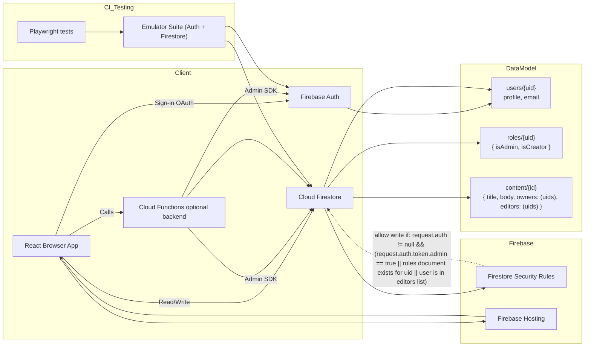

# React + Vite

This template provides a minimal setup to get React working in Vite with HMR and some ESLint rules.

Currently, two official plugins are available:

- [@vitejs/plugin-react](https://github.com/vitejs/vite-plugin-react/blob/main/packages/plugin-react) uses [Babel](https://babeljs.io/) (or [oxc](https://oxc.rs) when used in [rolldown-vite](https://vite.dev/guide/rolldown)) for Fast Refresh
- [@vitejs/plugin-react-swc](https://github.com/vitejs/vite-plugin-react/blob/main/packages/plugin-react-swc) uses [SWC](https://swc.rs/) for Fast Refresh

## React Compiler

The React Compiler is not enabled on this template because of its impact on dev & build performances. To add it, see [this documentation](https://react.dev/learn/react-compiler/installation).

## Expanding the ESLint configuration

If you are developing a production application, we recommend using TypeScript with type-aware lint rules enabled. Check out the [TS template](https://github.com/vitejs/vite/tree/main/packages/create-vite/template-react-ts) for information on how to integrate TypeScript and [`typescript-eslint`](https://typescript-eslint.io) in your project.

---

## End-to-end testing with Playwright

This project includes a Playwright test that verifies clicking a calendar event opens the details dialog.

From a fresh clone, follow these steps to set up and run the E2E tests locally:

1. Install dependencies:

```bash
npm install
```

2. Install Playwright browsers (required once on the machine):

```bash
npx playwright install --with-deps
```

3. Run the Playwright tests (this will start the Vite dev server defined in `playwright.config.js`):

```bash
npm run test:e2e
```

Notes:

- The Playwright test files live under `tests/` and the runner is configured in `playwright.config.js`.
- The Playwright config starts the dev server on port `5174` by default. If that port is occupied you can either adjust `playwright.config.js` or start the dev server manually on the same port before running the tests:

```bash
npm run dev -- --port 5174
```

- On CI, ensure you run `npx playwright install --with-deps` during setup so browsers are available.
- Recommended Node.js: 18+.
 
## Architecture Thoughts

